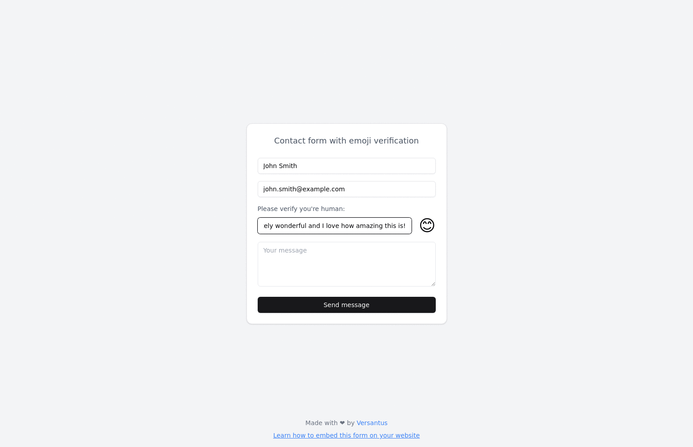

# Emoji Captcha

A modern, user-friendly CAPTCHA system that verifies humanity through sentiment analysis. Instead of decoding distorted text or selecting images, users prove they're human by expressing positive sentiment.

## Features

- 😊 Sentiment-based verification
- 🎯 Real-time emoji feedback
- 📱 Responsive design
- 🔌 Easy integration
- 🎨 Automatic theme matching

## Demo

Try it out at: https://emoji-human-app-oidkg8bv.devinapps.com



Watch as the emoji responds to different types of input:
- Neutral statements keep the emoji neutral 😐
- Negative comments make the emoji angry 😠
- Positive messages make the emoji smile 😊 and verify you're human!

## Quick Start

1. Add the script to your HTML:
```html
<script src="https://emoji-human-app-jdrciuzl.devinapps.com/embed.js"></script>
```

2. Add the verification element:
```html
<div id="emoji-verification"></div>
```

3. Initialize the verification:
```javascript
const verification = new EmojiVerification({
  element: '#emoji-verification',
  onVerified: (isHuman) => {
    if (isHuman) {
      // Enable your form submission
    }
  }
});
```

## How It Works

1. The system presents users with an emoji face and a text input
2. Users type a message into the input field
3. Advanced sentiment analysis evaluates the message:
   - Positive sentiment: Happy emoji 😊, verification successful
   - Neutral sentiment: Neutral emoji 😐, verification pending
   - Negative sentiment: Angry emoji 😠, verification failed
4. Upon successful verification, your form is enabled

## Features in Detail

### Sentiment Analysis
- Professional sentiment analysis library
- Real-time feedback
- Nuanced scoring system
- Multiple sentiment thresholds

### User Interface
- Clean, modern design
- Mobile-responsive layout
- Accessible components
- Real-time emoji reactions

### Integration
- Simple 3-step setup
- Minimal code required
- Automatic theme adaptation
- Customizable callbacks

## Development

Built with:
- React + TypeScript
- Tailwind CSS
- shadcn/ui components
- Sentiment analysis library

## License

Created by Versantus. All rights reserved.
